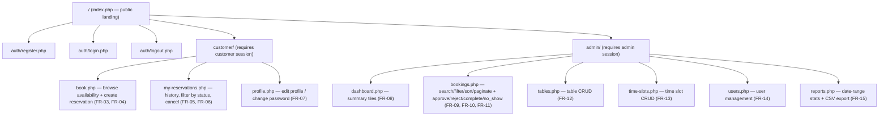

# UI/UX Design Process — Golden Lotus Restaurant Reservation System

Phase P4 deliverable. Written before any page markup exists (Phase P4b/P5+),
so the visual language and navigation are decided once and applied
consistently afterward, rather than improvised page by page. Traces back to
the actors and requirements in `docs/requirements.md` §5–7 and forward to
`public/css/style.css` (design tokens) and the report §3 (Implementation
evidence — screenshots).

## 1. User needs analysis

Two actors (`docs/requirements.md` §5), two very different contexts of use:

| | Customer | Admin |
|---|---|---|
| Device | Mostly phone, booking on the go (down to 375px per NFR-03) | Mostly desktop, at the restaurant during service |
| Session length | Short (book in "a couple of minutes" — §2 objectives) | Long (working the pending queue repeatedly through a shift) |
| Primary need | Confidence the booking went through, and its current status | Speed: see today's load, clear pending queue, act on it |
| Tolerance for clutter | Low — one clear task at a time | Higher — dense tables/filters are expected and wanted |
| Error costs | A missed conflict = arriving to no table | A missed pending booking = an unhappy walk-in customer |

Design consequences drawn from this:
- Customer-facing pages: one primary action per screen, generous spacing,
  large touch targets, minimal choices visible at once (progressive
  disclosure of the booking form: date → slot → party size → table).
- Admin-facing pages: information-dense tables, inline filters, and
  status-colour-coded rows so the pending queue is scannable at a glance —
  this directly serves FR-08/FR-09/FR-10/FR-11.
- Both: every state-changing action gives immediate, unambiguous feedback
  (flash message + updated status), because "silent failure" is explicitly
  ruled out by NFR-03.

## 2. Sitemap



Every logged-in page shares one header/footer (`includes/header.php`,
`includes/footer.php`, built in Phase P4b) with role-aware navigation: the
customer nav shows Book / My Reservations / Profile; the admin nav shows
Dashboard / Bookings / Tables / Time Slots / Users / Reports. A visitor with
no session only ever sees Login / Register.

## 3. User flows

**Customer — make a reservation (the core workflow, see
`docs/diagrams/activity-booking.mmd` for the full decision tree):**
Landing → Login (if not already) → Book a Table → pick **date, time slot,
and party size together** as the search criteria → system lists tables
whose capacity is sufficient and that have no non-cancelled booking for that
exact date/slot → pick **table only** from the results → confirm → flash
"submitted, pending approval" → My Reservations shows it as `pending`.
(Corrected 2026-08-03: this previously said the slot was chosen after
seeing availability, which contradicted §4.3's wireframe and both
`docs/diagrams/activity-booking.mmd` and `sequence-booking.mmd` — those two
diagrams already treat date+slot+party size as the upfront search input and
were left unchanged; this paragraph was the one that was wrong.)

**Customer — cancel:**
My Reservations → find booking (status `pending`/`confirmed`) → Cancel →
confirm → flash "cancelled", row updates in place, no page reload of the
whole list needed beyond the one row.

**Admin — clear the pending queue:**
Dashboard (sees pending count tile) → click through to Bookings filtered to
`pending` → Approve or Reject per row → flash confirms → dashboard's pending
count decrements on next view.

**Admin — end of service:**
Bookings filtered to today, status `confirmed`, past slot end time →
mark Completed or No-show per row.

## 4. Wireframes — 5 main screens

Text wireframes only at this stage (Phase P4); annotated real screenshots are
captured in Phases P5–P7 for report §8.

### 4.1 Landing page (`index.php`)

```
┌──────────────────────────────────────────────────┐
│ Golden Lotus                    [Login] [Register]│
├──────────────────────────────────────────────────┤
│        Authentic Vietnamese dining —               │
│        reserve your table in seconds.               │
│               [ Book a Table ]                      │
├──────────────────────────────────────────────────┤
│  Opening hours: 11:00–22:00 daily                   │
│  4 areas: Indoor Main · Terrace · Garden · VIP      │
└──────────────────────────────────────────────────┘
```
One primary CTA above the fold; secondary info (hours/areas) below, not
competing for attention.

### 4.2 Login / Register

```
┌───────────────────────────┐
│         Login              │
│  Email    [____________]   │
│  Password [____________]   │
│  [ Log in ]                │
│  No account? Register →    │
│  (flash: validation errors │
│   appear here, above form) │
└───────────────────────────┘
```
Single centred card, one form, one primary button — matches the "low
clutter, one task" rule from §1.

### 4.3 Book a Table (`customer/book.php`)

```
┌──────────────────────────────────────────────────┐
│ Date [____] Party size [__] Slot [11:00-12:30 ▾] [Search]│
├──────────────────────────────────────────────────┤
│ Available tables:                                    │
│  ○ T05 — Indoor Main — seats 4   [Select]           │
│  ○ T12 — Terrace     — seats 6   [Select]           │
│  ○ V01 — VIP Room    — seats 8   [Select]           │
│  (smallest sufficient table listed first — locked rule)│
├──────────────────────────────────────────────────┤
│ Notes (optional) [______________________]           │
│                [ Confirm Reservation ]              │
└──────────────────────────────────────────────────┘
```
Progressive disclosure: table list and the confirm button only appear after
a search; prevents the customer from being shown irrelevant controls first.

### 4.4 My Reservations (`customer/my-reservations.php`)

```
┌──────────────────────────────────────────────────┐
│ Filter status: [All ▾]                              │
├──────────────────────────────────────────────────┤
│ 2026-08-10  18:30-20:00  T05  4 guests  [Confirmed] │
│ 2026-08-03  14:00-15:30  T12  2 guests  [Pending] [Cancel]│
│ 2026-07-28  17:00-18:30  V01  8 guests  [Completed] │
└──────────────────────────────────────────────────┘
```
Status shown as a colour-coded badge (see §5); Cancel button only rendered
for rows whose status is `pending`/`confirmed`, per FR-06.

### 4.5 Admin Dashboard (`admin/dashboard.php`)

```
┌──────────────────────────────────────────────────┐
│ [Today: 12]  [Pending: 5]  [Cancel rate: 8%]  [Busiest: 18:30-20:00]│
├──────────────────────────────────────────────────┤
│ Pending queue (top 5) →  [ Go to full list ]        │
│  09:40  customer3  T09  4 guests  [Approve][Reject] │
│  ...                                                 │
└──────────────────────────────────────────────────┘
```
Four summary tiles answer FR-08 at a glance; the pending-queue preview below
gives a one-click path into `admin/bookings.php` (FR-09/FR-10) without
forcing a navigation click first — the highest-frequency admin action is
reachable from the very first screen of a shift.

## 5. Colour palette, typography, and spacing (with rationale)

CSS custom properties defined in `public/css/style.css :root`, layered on top
of (not replacing) Bootstrap 5 per the mandatory stack.

### 5.1 Colour palette

| Token | Value | Use | Rationale |
|---|---|---|---|
| `--gl-primary` | `#0B5D3B` (deep emerald green) | Header, nav, primary buttons | Evokes Vietnamese lacquerware/garden greens; distinct from Bootstrap's default blue so the brand reads as its own restaurant, not "a Bootstrap template" |
| `--gl-accent` | `#C9A227` (antique gold) | Decorative accents only — see §5.2 for why | "Golden Lotus" — the literal brand colour |
| `--gl-accent-soft` | `#F4E7C1` | Card highlights, hover backgrounds | Muted tint of the gold accent for subtle emphasis without shouting |
| `--gl-text` | `#1F2A24` | Body text | Near-black with a green cast, ties back to the primary colour |
| `--gl-bg` | `#FAF8F2` | Page background | Warm off-white (tablecloth/paper tone) instead of stark white — fits a "fine dining" feel |

**Status badge colours** (used on My Reservations and the admin Bookings
list — one consistent mapping everywhere, per the status lifecycle in
`CLAUDE.md`). These are Bootstrap 5.3's own `text-bg-*` utility pairs
(background + Bootstrap's built-in contrasting text colour), not custom
tokens, so their contrast is evaluated in §5.2 rather than invented here:

| Status | Colour | Bootstrap class |
|---|---|---|
| `pending` | amber | `text-bg-warning` |
| `confirmed` | green | `text-bg-success` |
| `completed` | blue-grey | `text-bg-info` |
| `no_show` | dark red | `text-bg-danger` (outline variant, see below) |
| `cancelled` | grey | `text-bg-secondary` |
| `rejected` | red | `text-bg-danger` |

`no_show` and `rejected` are both semantically "bad" but must stay visually
distinguishable at a glance (no_show is a past-tense customer failure,
rejected is an admin decision) — `no_show` uses a danger *outline* style
(`.badge-status-no-show` in `style.css`: `#dc3545` text on a forced white
background, not transparent — see §5.2 for why) while `rejected` uses solid
danger, so the two never look identical in the same table column.

### 5.2 Contrast ratios — accessibility evidence

Calculated from the actual hex values above using the WCAG 2.1 relative
luminance formula (`L = 0.2126R + 0.7152G + 0.0722B` on linearised sRGB
channels) and contrast ratio `(L1+0.05)/(L2+0.05)`. AA thresholds: **4.5:1**
normal text, **3.0:1** large text (≥24px, or ≥18.66px bold). Every pair the
app actually renders:

| Foreground / background | Ratio | AA normal (4.5:1) | AA large (3.0:1) |
|---|---|---|---|
| `--gl-text` (`#1F2A24`) on `--gl-bg` (`#FAF8F2`) | **13.97:1** | Pass | Pass |
| `--gl-text` (`#1F2A24`) on white (`#FFFFFF`) | **14.84:1** | Pass | Pass |
| white on `--gl-primary` (`#0B5D3B`) | **7.94:1** | Pass (also clears AAA's 7:1) | Pass |
| `--gl-accent` (`#C9A227`) on `--gl-bg` (`#FAF8F2`) | **2.28:1** | **Fail** | **Fail** |
| white on `text-bg-success` (`#198754`) — `confirmed` | **4.53:1** | Pass (marginal) | Pass |
| black on `text-bg-warning` (`#FFC107`) — `pending` | **12.88:1** | Pass | Pass |
| black on `text-bg-info` (`#0DCAF0`) — `completed` | **10.72:1** | Pass | Pass |
| white on `text-bg-danger` (`#DC3545`) — `rejected` | **4.53:1** | Pass (marginal) | Pass |
| white on `text-bg-secondary` (`#6C757D`) — `cancelled` | **4.69:1** | Pass | Pass |
| `no_show` outline text (`#DC3545`) on white card/table row | **4.53:1** | Pass (marginal) | Pass |
| `no_show` outline text (`#DC3545`) directly on `--gl-bg` | **4.26:1** | **Fail** | Pass |

**Explicit restrictions from this evidence:**

- **`--gl-accent` (`#C9A227`) must never be used to render text of any size**
  on `--gl-bg` (or on white — the ratio only gets worse, since white is
  lighter than `--gl-bg`). It fails AA even at large-text size (2.28 < 3.0),
  so the original design note ("never as body text") was not cautious
  enough — it is not safe for headings either. It is restricted to
  non-text decoration: borders, icon fills, the `--gl-accent-soft` tint's
  own border, and hover-state background tints where the actual label text
  stays `--gl-text` or white, never `--gl-accent` itself.
- **The `no_show` outline badge (`#DC3545` text, transparent background)
  must always sit on a white card/table-row background, never directly on
  the raw `--gl-bg` page background.** On white it passes AA (4.53:1); laid
  directly on `--gl-bg` it drops to 4.26:1 and fails AA normal text (it
  still passes AA-large, but badge text is small, so normal-text rules
  apply). In practice this is already satisfied — Bootstrap's default
  `.card` and `.table` surfaces are white — but it must stay that way
  deliberately, not by accident, so no future page places this badge
  straight on the page background.
- The two badge pairs at **4.53:1** (`text-bg-success`, `text-bg-danger`)
  and **4.69:1** (`text-bg-secondary`) are Bootstrap 5.3's own built-in
  colour pairs, not something this project chose independently; they clear
  AA by a small margin and are left as-is for consistency with the rest of
  the mandated Bootstrap 5 UI layer rather than overridden with non-standard
  shades.

### 5.3 Typography scale

No external font is loaded (see §8 for the Google Fonts alternative that was
rejected). Headings use a system serif stack (`Georgia, 'Times New Roman',
serif`); body text uses Bootstrap's own default system-UI sans-serif stack.
Sizes, line-heights, and weights (all as CSS custom properties in
`style.css`, applied to the actual elements — not just named and left
unused):

| Level | Size | Line height | Weight | Font stack |
|---|---|---|---|---|
| `h1` | `2.5rem` (40px) | `1.2` | `700` | heading (serif) |
| `h2` | `2rem` (32px) | `1.25` | `700` | heading (serif) |
| `h3` | `1.5rem` (24px) | `1.3` | `600` | heading (serif) |
| body | `1rem` (16px) | `1.5` | `400` | body (system sans) |
| small | `0.875rem` (14px) | `1.4` | `400` | body (system sans) |

`h1`/`h2` at 700 weight and ≥24px both independently qualify as "large text"
under WCAG, which is why the `--gl-accent` restriction in §5.2 is stated as
an absolute ban rather than "avoid at normal size" — large text alone
doesn't rescue that pairing (2.28:1 fails even the 3.0:1 large-text bar).

### 5.4 Spacing scale

A single 6-step scale, so spacing is chosen from this list rather than
picked ad hoc per page (defined as CSS custom properties in `style.css`):

| Token | Value | Use |
|---|---|---|
| `--gl-space-1` | `0.25rem` (4px) | Tightest gaps: icon-to-label, badge internal padding |
| `--gl-space-2` | `0.5rem` (8px) | Gap between inline elements (e.g. buttons in a toolbar) |
| `--gl-space-3` | `1rem` (16px) | Default form-field gap, card internal padding |
| `--gl-space-4` | `1.5rem` (24px) | Gap between grouped fields/blocks within one card |
| `--gl-space-5` | `2rem` (32px) | Gap between major sections on a page (e.g. search bar vs. results) |
| `--gl-space-6` | `3rem` (48px) | Page-level top/bottom margin, hero section spacing |

These sit alongside Bootstrap's own spacing utilities (`.p-*`, `.m-*`,
`.gap-*`, based on a `0.25rem` step too) rather than replacing them — the
named tokens exist for custom rules in `style.css` where a Bootstrap
utility class doesn't directly apply (e.g. inside a custom component's own
CSS block).

## 6. Responsive breakpoint conventions

No custom breakpoints are defined — the app uses Bootstrap 5's breakpoints
exactly as shipped (`sm` 576px, `md` 768px, `lg` 992px, `xl` 1200px, `xxl`
1400px), via its existing grid/utility classes. Decision, not oversight:
introducing a second breakpoint system alongside Bootstrap's would violate
NFR-05 (maintainability/consistency) for no real gain, since Bootstrap's
defaults already satisfy NFR-03's 375px-width floor. Customer-facing pages
are designed mobile-first (single column below `md`); admin tables use
Bootstrap's `.table-responsive` horizontal scroll wrapper below `md` rather
than hiding columns, since admins must not lose data at smaller widths.

## 7. Error / success message conventions

- Every state-changing request follows Post/Redirect/Get: the POST handler
  sets one flash message in the session, then redirects; the next GET
  renders it as a single Bootstrap alert (`alert-success`, `alert-danger`,
  or `alert-warning`) at the top of the main content area, dismissible, then
  clears it from the session — so a page refresh never repeats a stale
  message and a form resubmission warning never appears.
- Field-level validation errors (e.g. weak password, invalid email) render
  inline directly under the offending field, in addition to the top-level
  alert — satisfies "surface validation errors ... inline on the same page"
  (NFR-03) rather than only a generic banner.
- Client-side validation (HTML5 `required`/`pattern`/JS checks) is UX-only
  and never trusted; every rule is re-checked server-side per the mandatory
  coding rules, so the same message wording is reused on both sides to avoid
  confusing the user with two different error texts for the same problem.

**Empty states** (exact wording, so it's implemented consistently rather than
each page inventing its own phrasing):

- My Reservations, no bookings at all: *"You have no reservations yet. [Book
  a Table] to get started."* — the bracketed text is a button/link straight
  into `customer/book.php`, not just a passive message.
- Admin pending queue, nothing pending: *"No pending bookings right now —
  you're all caught up."*
- Table-availability search with no results (the `A6` box in
  `activity-booking.mmd`): *"No tables are available for this date, time
  slot, and party size. Try a different date, time, or slot."*
- Admin Bookings list, a search/filter combination matches nothing (FR-09):
  *"No bookings match these filters. Try widening the date range or
  clearing a filter."*

**Loading / disabled button states** — prevents a customer double-submitting
a reservation (or an admin double-clicking approve/reject) while a request is
in flight:

- On submit, vanilla JS disables the submit button immediately (before the
  network request resolves) and swaps its label to a short in-progress
  state (e.g. "Submitting…") with a small Bootstrap spinner icon.
- The button is only re-enabled if the response is an error the user must
  correct; on success the page redirects (PRG pattern above), so there is
  nothing to re-enable.
- This is a UX safeguard only, not a security control — the real
  double-booking defence is the database-level `uq_reservations_active_slot`
  unique constraint (NFR-06, proven live in
  `docs/evidence/double-booking-proof.md`), which holds even if JavaScript
  is disabled or a second request is fired some other way. Disabling the
  button just prevents the user from seeing a confusing duplicate-attempt
  error in the first place.

**Destructive action confirmation** — Cancel (customer) and Reject (admin)
each require an explicit confirmation step before the POST fires (a vanilla
JS `confirm()` gate on the button's click handler, with specific wording per
action, e.g. *"Cancel this reservation? This cannot be undone."* /
*"Reject this booking? The customer will be notified and cannot be
re-approved afterwards."* Approve does not require one. The deciding
factor is **reversibility under the status lifecycle locked in
`CLAUDE.md`**: `cancelled` and `rejected` are both terminal — the lifecycle
diagram has no transition out of either state back to `pending`/`confirmed`,
so a mistaken click can only be undone by the customer creating a brand-new
reservation from scratch. Approving is not terminal in the same sense (a
confirmed booking can still be rejected-equivalent by the customer
cancelling, or the admin can still act on it later), and it is also the
highest-frequency admin action during a shift (§1) — gating it behind a
confirmation dialog would add friction to the common case for no matching
reduction in risk. The rule is "does this status change close off every
future path for this booking," not "which actor performs it."

## 8. Alternatives considered and rejected

- **Google Fonts (e.g. Playfair Display + Inter) for a more distinctive
  look** — rejected: adds an external CDN dependency beyond the one already
  authorised (Bootstrap 5) and CLAUDE.md's mandatory stack lists no other
  CDN; also a small extra network request/FOUC risk against NFR-01/NFR-03.
  A system serif/sans pairing achieves a similar "fine dining vs. plain
  Bootstrap" distinction at zero extra cost.
- **A custom breakpoint system** — rejected in favour of Bootstrap's
  defaults; see §6.
- **A fully custom design system (no Bootstrap components)** — rejected
  outright: CLAUDE.md mandates Bootstrap 5 as the UI layer; the design
  tokens in §5 are meant to sit on top of it, not replace it.
- **Hiding table columns on the admin Bookings list at narrow widths** —
  rejected in favour of horizontal scroll (`.table-responsive`); admins
  need every column (date, slot, table, customer, status, actions)
  available at once for FR-09, and hiding columns silently would risk an
  admin acting on a row without seeing its full context.
- **Separate colour per booking status chosen ad hoc per page** — rejected;
  a single status→colour mapping (§5) is defined once here and must be
  reused on every screen that shows a status, so the customer and admin
  interfaces stay visually consistent (NFR-05).
