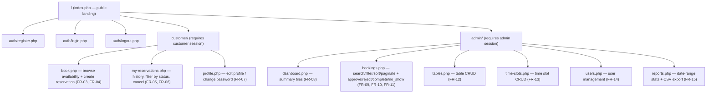

# UI/UX Design Process — Golden Lotus Restaurant Reservation System

Phase P4 deliverable. Written before any page markup exists (Phase P4b/P5+),
so the visual language and navigation are decided once and applied
consistently afterward, rather than improvised page by page. Traces back to
the actors and requirements in `docs/requirements.md` §5–7 and forward to
`public/css/style.css` (design tokens) and the report §3 (Implementation
evidence — screenshots).

## 1. User needs analysis

Two actors (`docs/requirements.md` §5), two very different contexts of use:

| | Customer | Admin |
|---|---|---|
| Device | Mostly phone, booking on the go (down to 375px per NFR-03) | Mostly desktop, at the restaurant during service |
| Session length | Short (book in "a couple of minutes" — §2 objectives) | Long (working the pending queue repeatedly through a shift) |
| Primary need | Confidence the booking went through, and its current status | Speed: see today's load, clear pending queue, act on it |
| Tolerance for clutter | Low — one clear task at a time | Higher — dense tables/filters are expected and wanted |
| Error costs | A missed conflict = arriving to no table | A missed pending booking = an unhappy walk-in customer |

Design consequences drawn from this:
- Customer-facing pages: one primary action per screen, generous spacing,
  large touch targets, minimal choices visible at once (progressive
  disclosure of the booking form: date → slot → party size → table).
- Admin-facing pages: information-dense tables, inline filters, and
  status-colour-coded rows so the pending queue is scannable at a glance —
  this directly serves FR-08/FR-09/FR-10/FR-11.
- Both: every state-changing action gives immediate, unambiguous feedback
  (flash message + updated status), because "silent failure" is explicitly
  ruled out by NFR-03.

## 2. Sitemap



Every logged-in page shares one header/footer (`includes/header.php`,
`includes/footer.php`, built in Phase P4b) with role-aware navigation: the
customer nav shows Book / My Reservations / Profile; the admin nav shows
Dashboard / Bookings / Tables / Time Slots / Users / Reports. A visitor with
no session only ever sees Login / Register.

## 3. User flows

**Customer — make a reservation (the core workflow, see
`docs/diagrams/activity-booking.mmd` for the full decision tree):**
Landing → Login (if not already) → Book a Table → pick **date, time slot,
and party size together** as the search criteria → system lists tables
whose capacity is sufficient and that have no non-cancelled booking for that
exact date/slot → pick **table only** from the results → confirm → flash
"submitted, pending approval" → My Reservations shows it as `pending`.
(Corrected 2026-08-03: this previously said the slot was chosen after
seeing availability, which contradicted §4.3's wireframe and both
`docs/diagrams/activity-booking.mmd` and `sequence-booking.mmd` — those two
diagrams already treat date+slot+party size as the upfront search input and
were left unchanged; this paragraph was the one that was wrong.)

**Customer — cancel:**
My Reservations → find booking (status `pending`/`confirmed`) → Cancel →
confirm → flash "cancelled", row updates in place, no page reload of the
whole list needed beyond the one row.

**Admin — clear the pending queue:**
Dashboard (sees pending count tile) → click through to Bookings filtered to
`pending` → Approve or Reject per row → flash confirms → dashboard's pending
count decrements on next view.

**Admin — end of service:**
Bookings filtered to today, status `confirmed`, past slot end time →
mark Completed or No-show per row.

## 4. Wireframes — 5 main screens

Text wireframes only at this stage (Phase P4); annotated real screenshots are
captured in Phases P5–P7 for report §8.

### 4.1 Landing page (`index.php`)

```
┌──────────────────────────────────────────────────┐
│ Golden Lotus                    [Login] [Register]│
├──────────────────────────────────────────────────┤
│        Authentic Vietnamese dining —               │
│        reserve your table in seconds.               │
│               [ Book a Table ]                      │
├──────────────────────────────────────────────────┤
│  Opening hours: 11:00–22:00 daily                   │
│  4 areas: Indoor Main · Terrace · Garden · VIP      │
└──────────────────────────────────────────────────┘
```
One primary CTA above the fold; secondary info (hours/areas) below, not
competing for attention.

### 4.2 Login / Register

```
┌───────────────────────────┐
│         Login              │
│  Email    [____________]   │
│  Password [____________]   │
│  [ Log in ]                │
│  No account? Register →    │
│  (flash: validation errors │
│   appear here, above form) │
└───────────────────────────┘
```
Single centred card, one form, one primary button — matches the "low
clutter, one task" rule from §1.

### 4.3 Book a Table (`customer/book.php`)

```
┌──────────────────────────────────────────────────┐
│ Date [____] Party size [__] Slot [11:00-12:30 ▾] [Search]│
├──────────────────────────────────────────────────┤
│ Available tables:                                    │
│  ○ T05 — Indoor Main — seats 4   [Select]           │
│  ○ T12 — Terrace     — seats 6   [Select]           │
│  ○ V01 — VIP Room    — seats 8   [Select]           │
│  (smallest sufficient table listed first — locked rule)│
├──────────────────────────────────────────────────┤
│ Notes (optional) [______________________]           │
│                [ Confirm Reservation ]              │
└──────────────────────────────────────────────────┘
```
Progressive disclosure: table list and the confirm button only appear after
a search; prevents the customer from being shown irrelevant controls first.

### 4.4 My Reservations (`customer/my-reservations.php`)

```
┌──────────────────────────────────────────────────┐
│ Filter status: [All ▾]                              │
├──────────────────────────────────────────────────┤
│ 2026-08-10  18:30-20:00  T05  4 guests  [Confirmed] │
│ 2026-08-03  14:00-15:30  T12  2 guests  [Pending] [Cancel]│
│ 2026-07-28  17:00-18:30  V01  8 guests  [Completed] │
└──────────────────────────────────────────────────┘
```
Status shown as a colour-coded badge (see §5); Cancel button only rendered
for rows whose status is `pending`/`confirmed`, per FR-06.

### 4.5 Admin Dashboard (`admin/dashboard.php`)

```
┌──────────────────────────────────────────────────┐
│ [Today: 12]  [Pending: 5]  [Cancel rate: 8%]  [Busiest: 18:30-20:00]│
├──────────────────────────────────────────────────┤
│ Pending queue (top 5) →  [ Go to full list ]        │
│  09:40  customer3  T09  4 guests  [Approve][Reject] │
│  ...                                                 │
└──────────────────────────────────────────────────┘
```
Four summary tiles answer FR-08 at a glance; the pending-queue preview below
gives a one-click path into `admin/bookings.php` (FR-09/FR-10) without
forcing a navigation click first — the highest-frequency admin action is
reachable from the very first screen of a shift.

## 5. Colour palette, typography, and spacing (with rationale)

CSS custom properties defined in `public/css/style.css :root`, layered on top
of (not replacing) Bootstrap 5 per the mandatory stack.

### 5.1 Colour palette

| Token | Value | Use | Rationale |
|---|---|---|---|
| `--gl-primary` | `#0B5D3B` (deep emerald green) | Header, nav, primary buttons | Evokes Vietnamese lacquerware/garden greens; distinct from Bootstrap's default blue so the brand reads as its own restaurant, not "a Bootstrap template" |
| `--gl-accent` | `#C9A227` (antique gold) | Decorative accents only — see §5.2 for why | "Golden Lotus" — the literal brand colour |
| `--gl-accent-soft` | `#F4E7C1` | Card highlights, hover backgrounds | Muted tint of the gold accent for subtle emphasis without shouting |
| `--gl-text` | `#1F2A24` | Body text | Near-black with a green cast, ties back to the primary colour |
| `--gl-bg` | `#FAF8F2` | Page background | Warm off-white (tablecloth/paper tone) instead of stark white — fits a "fine dining" feel |

**Status badge colours** (used on My Reservations and the admin Bookings
list — one consistent mapping everywhere, per the status lifecycle in
`CLAUDE.md`). These are Bootstrap 5.3's own `text-bg-*` utility pairs
(background + Bootstrap's built-in contrasting text colour), not custom
tokens, so their contrast is evaluated in §5.2 rather than invented here:

| Status | Colour | Bootstrap class |
|---|---|---|
| `pending` | amber | `text-bg-warning` |
| `confirmed` | green | `text-bg-success` |
| `completed` | blue-grey | `text-bg-info` |
| `no_show` | dark red | `text-bg-danger` (outline variant, see below) |
| `cancelled` | grey | `text-bg-secondary` |
| `rejected` | red | `text-bg-danger` |

`no_show` and `rejected` are both semantically "bad" but must stay visually
distinguishable at a glance (no_show is a past-tense customer failure,
rejected is an admin decision) — `no_show` uses a danger *outline* style
(`.badge-status-no-show` in `style.css`: `#dc3545` text on a forced white
background, not transparent — see §5.2 for why) while `rejected` uses solid
danger, so the two never look identical in the same table column.

### 5.2 Contrast ratios — accessibility evidence

Calculated from the actual hex values above using the WCAG 2.1 relative
luminance formula (`L = 0.2126R + 0.7152G + 0.0722B` on linearised sRGB
channels) and contrast ratio `(L1+0.05)/(L2+0.05)`. AA thresholds: **4.5:1**
normal text, **3.0:1** large text (≥24px, or ≥18.66px bold). Every pair the
app actually renders:

| Foreground / background | Ratio | AA normal (4.5:1) | AA large (3.0:1) |
|---|---|---|---|
| `--gl-text` (`#1F2A24`) on `--gl-bg` (`#FAF8F2`) | **13.97:1** | Pass | Pass |
| `--gl-text` (`#1F2A24`) on white (`#FFFFFF`) | **14.84:1** | Pass | Pass |
| white on `--gl-primary` (`#0B5D3B`) | **7.94:1** | Pass (also clears AAA's 7:1) | Pass |
| `--gl-accent` (`#C9A227`) on `--gl-bg` (`#FAF8F2`) | **2.28:1** | **Fail** | **Fail** |
| white on `text-bg-success` (`#198754`) — `confirmed` | **4.53:1** | Pass (marginal) | Pass |
| black on `text-bg-warning` (`#FFC107`) — `pending` | **12.88:1** | Pass | Pass |
| black on `text-bg-info` (`#0DCAF0`) — `completed` | **10.72:1** | Pass | Pass |
| white on `text-bg-danger` (`#DC3545`) — `rejected` | **4.53:1** | Pass (marginal) | Pass |
| white on `text-bg-secondary` (`#6C757D`) — `cancelled` | **4.69:1** | Pass | Pass |
| `no_show` outline text (`#DC3545`) on white card/table row | **4.53:1** | Pass (marginal) | Pass |
| `no_show` outline text (`#DC3545`) directly on `--gl-bg` | **4.26:1** | **Fail** | Pass |

**Explicit restrictions from this evidence:**

- **`--gl-accent` (`#C9A227`) must never be used to render text of any size**
  on `--gl-bg` (or on white — the ratio only gets worse, since white is
  lighter than `--gl-bg`). It fails AA even at large-text size (2.28 < 3.0),
  so the original design note ("never as body text") was not cautious
  enough — it is not safe for headings either. It is restricted to
  non-text decoration: borders, icon fills, the `--gl-accent-soft` tint's
  own border, and hover-state background tints where the actual label text
  stays `--gl-text` or white, never `--gl-accent` itself.
- **The `no_show` outline badge (`#DC3545` text, transparent background)
  must always sit on a white card/table-row background, never directly on
  the raw `--gl-bg` page background.** On white it passes AA (4.53:1); laid
  directly on `--gl-bg` it drops to 4.26:1 and fails AA normal text (it
  still passes AA-large, but badge text is small, so normal-text rules
  apply). In practice this is already satisfied — Bootstrap's default
  `.card` and `.table` surfaces are white — but it must stay that way
  deliberately, not by accident, so no future page places this badge
  straight on the page background.
- The two badge pairs at **4.53:1** (`text-bg-success`, `text-bg-danger`)
  and **4.69:1** (`text-bg-secondary`) are Bootstrap 5.3's own built-in
  colour pairs, not something this project chose independently; they clear
  AA by a small margin and are left as-is for consistency with the rest of
  the mandated Bootstrap 5 UI layer rather than overridden with non-standard
  shades.

### 5.3 Typography scale

**Updated 2026-08-05 (Typography upgrade pass) — superseded from a
system-only stack to self-hosted webfonts; see §9.9 for the full decision
record, including why this is not the same CDN trade-off §8 originally
rejected.** Headings use **Playfair Display** (self-hosted, weights
400/600/700), falling back to the original system serif stack (`Georgia,
'Times New Roman', serif`) if the webfont fails to load for any reason.
Body text uses **Be Vietnam Pro** (self-hosted, same three weights),
falling back to Bootstrap's own default system-UI sans-serif stack. Both
font stacks are still CSS custom properties in `style.css`
(`--gl-font-heading`, `--gl-font-body`), applied to the actual elements,
with the real webfont always listed first and the original fallback stack
kept intact behind it — a failed font load degrades to the pre-upgrade
look, never to a blank/invisible page (`font-display: swap` shows the
fallback immediately while the real font loads in the background).

| Level | Size | Line height | Weight | Font stack |
|---|---|---|---|---|
| `h1` | `2.25rem` (36px) | `1.2` | `700` | heading (Playfair Display → Georgia) |
| `h2` | `1.875rem` (30px) | `1.25` | `700` | heading (Playfair Display → Georgia) |
| `h3` | `1.375rem` (22px) | `1.3` | `600` | heading (Playfair Display → Georgia) |
| body | `1rem` (16px) | `1.5` | `400` | body (Be Vietnam Pro → system sans) |
| small | `0.875rem` (14px) | `1.4` | `400` | body (Be Vietnam Pro → system sans) |

`h1`/`h2` at 700 weight and ≥24px both independently qualify as "large text"
under WCAG, which is why the `--gl-accent` restriction in §5.2 is stated as
an absolute ban rather than "avoid at normal size" — large text alone
doesn't rescue that pairing (2.28:1 fails even the 3.0:1 large-text bar).
This still holds at the new `h1`/`h2` sizes (36px/30px, both still ≥24px).

**Why the sizes dropped from the original values (`h1` 2.5rem→2.25rem, `h2`
2rem→1.875rem, `h3` 1.5rem→1.375rem) and gained `--gl-ls-heading: -0.01em`:**
Playfair Display's default sidebearings (the built-in space around each
glyph) run wider than Georgia's at display sizes, which risked short
headings (modal titles next to a close button, card headings, tile labels)
wrapping to a second line where they previously fit on one. A small,
standard mitigation for display serif typefaces — a modest negative
letter-spacing plus a slightly smaller scale — recovers most of that width
back without the heading reading as visually "off"; both changes apply
uniformly via the shared `h1, h2, h3, h4, h5, h6` rule and the `:root`
scale tokens, not per-page overrides.

### 5.4 Spacing scale

A single 6-step scale, so spacing is chosen from this list rather than
picked ad hoc per page (defined as CSS custom properties in `style.css`):

| Token | Value | Use |
|---|---|---|
| `--gl-space-1` | `0.25rem` (4px) | Tightest gaps: icon-to-label, badge internal padding |
| `--gl-space-2` | `0.5rem` (8px) | Gap between inline elements (e.g. buttons in a toolbar) |
| `--gl-space-3` | `1rem` (16px) | Default form-field gap, card internal padding |
| `--gl-space-4` | `1.5rem` (24px) | Gap between grouped fields/blocks within one card |
| `--gl-space-5` | `2rem` (32px) | Gap between major sections on a page (e.g. search bar vs. results) |
| `--gl-space-6` | `3rem` (48px) | Page-level top/bottom margin, hero section spacing |

These sit alongside Bootstrap's own spacing utilities (`.p-*`, `.m-*`,
`.gap-*`, based on a `0.25rem` step too) rather than replacing them — the
named tokens exist for custom rules in `style.css` where a Bootstrap
utility class doesn't directly apply (e.g. inside a custom component's own
CSS block).

## 6. Responsive breakpoint conventions

No custom breakpoints are defined — the app uses Bootstrap 5's breakpoints
exactly as shipped (`sm` 576px, `md` 768px, `lg` 992px, `xl` 1200px, `xxl`
1400px), via its existing grid/utility classes. Decision, not oversight:
introducing a second breakpoint system alongside Bootstrap's would violate
NFR-05 (maintainability/consistency) for no real gain, since Bootstrap's
defaults already satisfy NFR-03's 375px-width floor. Customer-facing pages
are designed mobile-first (single column below `md`); admin tables use
Bootstrap's `.table-responsive` horizontal scroll wrapper below `md` rather
than hiding columns, since admins must not lose data at smaller widths.

## 7. Error / success message conventions

- Every state-changing request follows Post/Redirect/Get: the POST handler
  sets one flash message in the session, then redirects; the next GET
  renders it as a single Bootstrap alert (`alert-success`, `alert-danger`,
  or `alert-warning`) at the top of the main content area, dismissible, then
  clears it from the session — so a page refresh never repeats a stale
  message and a form resubmission warning never appears.
- Field-level validation errors (e.g. weak password, invalid email) render
  inline directly under the offending field, in addition to the top-level
  alert — satisfies "surface validation errors ... inline on the same page"
  (NFR-03) rather than only a generic banner.
- Client-side validation (HTML5 `required`/`pattern`/JS checks) is UX-only
  and never trusted; every rule is re-checked server-side per the mandatory
  coding rules, so the same message wording is reused on both sides to avoid
  confusing the user with two different error texts for the same problem.

**Empty states** (exact wording, so it's implemented consistently rather than
each page inventing its own phrasing):

- My Reservations, no bookings at all: *"You have no reservations yet. [Book
  a Table] to get started."* — the bracketed text is a button/link straight
  into `customer/book.php`, not just a passive message.
- Admin pending queue, nothing pending: *"No pending bookings right now.
  You're all caught up."* (updated 2026-08-05, typography/copy pass — was
  originally one dash-joined sentence; split into two short sentences to
  remove the em dash, per the project's punctuation-style sweep. This is a
  narrow, deliberate exception to that sweep's "leave `docs/` alone" rule:
  this specific quoted string is the locked wording contract
  `admin/dashboard.php` is required to reproduce verbatim, not general
  documentation prose, so leaving it out of sync with the actual
  implementation would itself be a doc/implementation inconsistency.)
- Table-availability search with no results (the `A6` box in
  `activity-booking.mmd`): *"No tables are available for this date, time
  slot, and party size. Try a different date, time, or slot."*
- Admin Bookings list, a search/filter combination matches nothing (FR-09):
  *"No bookings match these filters. Try widening the date range or
  clearing a filter."*

**Loading / disabled button states** — prevents a customer double-submitting
a reservation (or an admin double-clicking approve/reject) while a request is
in flight:

- On submit, vanilla JS disables the submit button immediately (before the
  network request resolves) and swaps its label to a short in-progress
  state (e.g. "Submitting…") with a small Bootstrap spinner icon.
- The button is only re-enabled if the response is an error the user must
  correct; on success the page redirects (PRG pattern above), so there is
  nothing to re-enable.
- This is a UX safeguard only, not a security control — the real
  double-booking defence is the database-level `uq_reservations_active_slot`
  unique constraint (NFR-06, proven live in
  `docs/evidence/double-booking-proof.md`), which holds even if JavaScript
  is disabled or a second request is fired some other way. Disabling the
  button just prevents the user from seeing a confusing duplicate-attempt
  error in the first place.

**Destructive action confirmation** — Cancel (customer) and Reject (admin)
each require an explicit confirmation step before the POST fires (a vanilla
JS `confirm()` gate on the button's click handler, with specific wording per
action, e.g. *"Cancel this reservation? This cannot be undone."* /
*"Reject this booking? The customer will be notified and cannot be
re-approved afterwards."* Approve does not require one. The deciding
factor is **reversibility under the status lifecycle locked in
`CLAUDE.md`**: `cancelled` and `rejected` are both terminal — the lifecycle
diagram has no transition out of either state back to `pending`/`confirmed`,
so a mistaken click can only be undone by the customer creating a brand-new
reservation from scratch. Approving is not terminal in the same sense (a
confirmed booking can still be rejected-equivalent by the customer
cancelling, or the admin can still act on it later), and it is also the
highest-frequency admin action during a shift (§1) — gating it behind a
confirmation dialog would add friction to the common case for no matching
reduction in risk. The rule is "does this status change close off every
future path for this booking," not "which actor performs it."

## 8. Alternatives considered and rejected

- **Google Fonts (e.g. Playfair Display + Inter) for a more distinctive
  look** — rejected: adds an external CDN dependency beyond the one already
  authorised (Bootstrap 5) and CLAUDE.md's mandatory stack lists no other
  CDN; also a small extra network request/FOUC risk against NFR-01/NFR-03.
  A system serif/sans pairing achieves a similar "fine dining vs. plain
  Bootstrap" distinction at zero extra cost.
  **Revisited 2026-08-05 (§9.9):** the specific objection above was the
  *CDN dependency* (a second external host beyond Bootstrap, plus the
  network/FOUC cost of fetching from it) — not the fonts themselves. Self-
  hosting the actual font files under `public/fonts/` removes the CDN
  dependency entirely (no request ever leaves the app's own server) while
  still getting the distinctive look this bullet originally wanted, so the
  project adopted Playfair Display (heading) and Be Vietnam Pro (body) as
  self-hosted webfonts. This is not a reversal of the reasoning above — it
  is the same reasoning applied to a delivery mechanism that didn't carry
  the original cost.
- **A custom breakpoint system** — rejected in favour of Bootstrap's
  defaults; see §6.
- **A fully custom design system (no Bootstrap components)** — rejected
  outright: CLAUDE.md mandates Bootstrap 5 as the UI layer; the design
  tokens in §5 are meant to sit on top of it, not replace it.
- **Hiding table columns on the admin Bookings list at narrow widths** —
  rejected in favour of horizontal scroll (`.table-responsive`); admins
  need every column (date, slot, table, customer, status, actions)
  available at once for FR-09, and hiding columns silently would risk an
  admin acting on a row without seeing its full context.
- **Separate colour per booking status chosen ad hoc per page** — rejected;
  a single status→colour mapping (§5) is defined once here and must be
  reused on every screen that shows a status, so the customer and admin
  interfaces stay visually consistent (NFR-05).

## 9. Polish pass (UI modernisation)

A later visual-upgrade pass (post Phase P7, application already
functionally complete) added depth, motion, and a signature identity on
top of everything above — **presentation only**, no business logic
changed, the locked status-badge colour mapping (§5.1) and the core
palette are untouched, and no new CDN/library was introduced (pure CSS +
hand-drawn inline SVG + vanilla JS, per the constraint that started this
pass). Every new token still derives from `--gl-primary`/`--gl-accent` —
nothing invents a new hue outside the palette locked in §5.1.

### 9.1 New tokens

All added to `public/css/style.css :root`, alongside (not replacing) the
§5 tokens:

| Token | Value | Use |
|---|---|---|
| `--gl-shadow-1` | soft, 2-layer, ~6-10% opacity | Default resting elevation (cards, buttons) |
| `--gl-shadow-2` | medium, 2-layer, ~6-10% opacity, larger blur | Hover/lift state |
| `--gl-shadow-3` | largest, 2-layer | Toasts, modals, hero — content that visually "floats" above the page |
| `--gl-radius-sm` | `0.375rem` | Buttons, inputs |
| `--gl-radius-md` | `0.75rem` | Cards, tiles, filter bars |
| `--gl-radius-lg` | `1.25rem` | Hero, auth split panel, modal, empty states |
| `--gl-t-fast` | `150ms ease` | Micro-interactions (focus glow, icon colour swap) |
| `--gl-t-base` | `250ms ease` | Card/button lift, modal, toast |
| `--gl-grad-hero` | radial gold glow (top-right) + linear green wash | Landing page hero background |
| `--gl-grad-panel` | linear green wash, 3 stops | Auth split-layout decorative panel |
| `--gl-grad-card` | linear, very low-opacity gold→green | Subtle depth on cards/tiles/empty states without leaving the `--gl-bg` family |

Shadows are deliberately soft and layered (two shadows per token: a tight
near-black-at-low-opacity layer plus a larger, softer spread) rather than
a single hard drop-shadow — "never harsh" was the brief, and a single
sharp shadow reads as a dated, flat design choice on a warm off-white
background like `--gl-bg`.

### 9.2 Reduced-motion — accessibility decision

`@media (prefers-reduced-motion: reduce)` in `public/css/style.css`
collapses **every** animation/transition duration to near-zero
(`0.01ms !important`) for every element, in one universal rule, rather
than disabling each new effect individually. Two reasons for the blanket
approach over a piecemeal one: (1) it's easy to add a new animated
component later and forget to add its own reduced-motion carve-out — a
universal rule closes that gap by construction; (2) the actual harm
motion causes some users (vestibular disorders — nausea, dizziness
triggered by on-screen movement, independent of whether any single
animation "seems small") doesn't scale down gracefully with a smaller
animation, so partial compliance isn't a meaningfully safer middle ground
than full compliance. Every new animated feature in this pass (hero
entrance, scroll-reveal, toast slide-in, count-up tiles, report bar
growth, table-card stagger, row highlight, modal scale) was built to
degrade to "instant, correct final state" under this rule, not to break or
disappear — verified per component in §9.5.

### 9.3 Focus-visible — dual-layer ring, and why not a plain accent outline

Every interactive element gets a single global rule:
```css
:focus-visible {
  outline: 2px solid var(--gl-primary);
  outline-offset: 2px;
  box-shadow: 0 0 0 5px rgba(201, 162, 39, 0.32);
}
```
This replaces the narrower, component-specific focus rule from earlier
phases. The brief asked for an accent-coloured focus indicator, but §5.2
already proved `--gl-accent` (`#C9A227`) on `--gl-bg` measures **2.28:1**
— failing not just the 4.5:1 text threshold but also WCAG 1.4.11's
**3:1 minimum for non-text UI components**, which explicitly includes
focus indicators. A solid `--gl-accent` outline would therefore be a
genuine accessibility regression, not a style preference to weigh against
brand consistency. The resolution: the crisp, measurable outline is
`--gl-primary` (already proven **7.94:1** against every surface in the
app per §5.2's table), and `--gl-accent` is used only in a soft,
translucent `box-shadow` "halo" around it — decorative, not
the thing a low-vision user depends on to see where focus is, but still
enough for the ring to visibly read as gold-accented at normal viewing
distance. Same restriction already governed `--gl-accent` for text in
§5.2; this extends the identical reasoning to non-text UI, which is the
correct WCAG category for a focus ring.

### 9.4 The lotus motif — a hand-drawn, licence-free signature

`svg_lotus_motif()` in `includes/icons.php` draws a five-petal lotus
(one `<path>` "petal" shape, repeated four times via `transform="rotate"`
around a shared point) over two ripple-arc strokes at the base — pure
line art (`fill="none"`, `stroke="currentColor"`), so it always inherits
whatever colour context it's placed in (white on the hero, `--gl-primary`
in empty states, low-opacity on the auth panel) without a second colour
declaration anywhere it's used. Every other icon in the app (area glyphs,
admin tile icons, the sort-direction chevron, the table-selection check)
follows the same stroke-only, `currentColor`, hand-drawn convention in the
same file — deliberately, so the whole icon set reads as one system
instead of a mix of styles.

**Why draw it instead of using an icon library:** the brief ruled out
icon libraries and stock imagery entirely, but the deeper reason this is
the right call for a restaurant named "Golden Lotus" specifically is
identity — a generic Bootstrap-Icons flower glyph (if one even existed)
would look like every other template; a motif built from scratch for this
project cannot be mistaken for one, and comes with zero licensing
question to document (compare: the Google Fonts pairing rejected in §8
specifically to avoid exactly this kind of external dependency/licensing
overhead).

**Where it's used — deliberately sparse, per the brief:** the hero corner
(low opacity, positioned away from the CTA and heading text, §9.6), the
auth split-layout panel, every `.gl-empty-state` across the app (replacing
the ad hoc per-page emoji icons used immediately after Phase P7 — one
motif everywhere reads as intentional branding, six different emoji read
as unfinished), and a small footer mark. It is always `aria-hidden="true"`
— purely decorative, never the only carrier of information.

### 9.5 Component-by-component reduced-motion behaviour

| Component | Normal behaviour | Under `prefers-reduced-motion: reduce` |
|---|---|---|
| Hero heading/CTA entrance | Fade + slide-up, staggered | CSS duration collapses to ~0 — content appears instantly in its final position |
| Scroll-reveal (landing page area cards) | IntersectionObserver adds `.is-visible`, CSS fades/slides it in | Same class logic still runs (visibility isn't motion), but the transition itself is instant per the CSS rule |
| Toast slide-in / auto-dismiss | Slides in, success/info/warning auto-dismiss after 4s with a shrinking progress line | Slide-in is instant; auto-dismiss timing is driven by a JS `setTimeout` independent of the CSS animation, so the 4s dismiss still happens on schedule even though the progress line no longer visibly animates |
| Admin tile count-up | Numbers animate 0→value over ~650ms (`requestAnimationFrame`) | JS checks `matchMedia('(prefers-reduced-motion: reduce)')` and skips the animation loop entirely — the PHP-rendered final value is left untouched (it was never blanked to "0" in the first place) |
| Report bar growth | Bars grow from 0% to their value on load | JS still sets the target width (so the correct bar length is reached), but the CSS `transition` duration is ~0, so it appears instantly at full length instead of animating |
| Table-card stagger (book.php) | Cards fade in with a small per-card delay | All cards appear together, instantly |
| Row highlight (post-booking/cancel) | 2s colour fade on the affected row | Colour still applies and is still removed on the same JS timer, just without the animated fade — reads as a brief instant highlight instead |
| Modal open/close | Scale + fade | Instant show/hide (Bootstrap's own show/hide logic is untouched; only the CSS transition is neutralised) |

No component becomes non-functional or hides content under reduced
motion — the rule is "remove the animation, keep the end state," checked
per row above rather than assumed.

### 9.6 Contrast re-verification for new gradient/colour surfaces

Every text-bearing surface introduced in this pass was checked against
the same WCAG 2.1 relative-luminance method used in §5.2, not assumed:

| Foreground / background | Ratio | AA normal (4.5:1) |
|---|---|---|
| White on `--gl-grad-hero`'s lightest stop (`#0e7048`) | **6.12:1** | Pass |
| White on `--gl-grad-hero`'s middle stop (`#0b5d3b`) | **7.95:1** | Pass (matches §5.2's existing figure) |
| White on `--gl-grad-hero`'s darkest stop (`#073c26`) | **12.48:1** | Pass |
| New `.text-muted`/`.form-text` colour (`#5b6960`) on `--gl-bg` | **5.44:1** | Pass |
| New `.text-muted`/`.form-text` colour (`#5b6960`) on white (card surfaces) | **5.78:1** | Pass |

The hero heading sits inside `.gl-hero-content`, positioned toward the
left/centre of the block, while the gradient's only non-linear element —
the radial gold "glow" — is confined to the top-right corner
(`radial-gradient(... at 88% 8% ...)`) where the decorative lotus motif
lives, not the heading. Because the *linear* portion of the gradient
(which is what sits behind the actual text) ranges only between the three
stops measured above, and the lowest of those three already clears AA at
6.12:1, the heading's contrast is safe at every point along that range
without needing to model the radial layer's blend at all — the text
simply never overlaps it. `--gl-accent` itself is still never used as
text colour anywhere in this pass, consistent with §5.2's original
restriction.

### 9.7 Alternatives considered and rejected (this pass)

- **A JavaScript charting library for the reports bar chart** — rejected;
  the existing HTML/CSS bar chart from Phase P7 already satisfies "no
  charting library," and animating its existing `width` transition (JS
  only toggles a `data-target-width` value) achieves the same "grows on
  load" effect without adding a dependency.
- **`--gl-accent` as a solid focus-ring colour** — rejected; see §9.3.
- **Per-page emoji for empty-state icons** (the Phase P7 interim
  approach) — replaced with the single lotus motif everywhere; keeping
  emoji would have been faster but reads as unintentional/inconsistent
  once every other surface in the app carries a deliberate hand-drawn
  identity.
- **CSS-only `:has()` for table-card selection with no JS fallback** —
  `:has()` is supported on every browser NFR-04 targets (current stable
  Chrome/Firefox/Edge), so it's used as the primary mechanism, but a small
  JS listener still mirrors the same state into an `.is-selected` class as
  a low-cost belt-and-suspenders measure, not because `:has()` is expected
  to fail.

### 9.8 Post-release fix: invisible table cards, and the fail-safe reveal pattern

**Bug (2026-08-05, found in production use, not caught before shipping):**
`customer/book.php`'s search results rendered an available table for every
qualifying row, but every card stayed fully transparent — the layout space
was reserved (borders/padding/height all correct) but nothing was ever
visible to click. Root cause was a CSS authoring mistake, not a JavaScript
error: `--gl-t-base`/`--gl-t-fast` (§9.1) are defined as a **composite**
value, `"250ms ease"` (duration *and* easing together), specifically so
they drop cleanly into a `transition:` shorthand (`transition: box-shadow
var(--gl-t-base)` → `transition: box-shadow 250ms ease`, valid). Several
`animation:` shorthand declarations — `.gl-table-card`, `.gl-bar-row`,
`.invalid-feedback`, `.gl-toast`, `.gl-toast.is-leaving` — additionally
appended a literal `ease` keyword after the `var()`, e.g. `animation:
gl-fade-in-up var(--gl-t-base) ease forwards`, which expands to `250ms
ease ease forwards` — **two** easing-function values in one animation
definition. That's invalid per the CSS animation shorthand grammar (each
component may appear once), and per standard CSS error handling, an
invalid shorthand value is dropped **in its entirety**, not partially
applied. The `animation` property therefore never took effect at all, so
the separately-declared `opacity: 0` on those elements was never overridden
by anything — a fully unrelated-looking symptom (invisible content) traced
back to a single mistyped shorthand.

**Fix, two layers:**
1. Removed the redundant easing keyword everywhere `var(--gl-t-base)`/
   `var(--gl-t-fast)` appears inside an `animation:` shorthand — the token
   already supplies it.
2. Generalised the fail-safe pattern the scroll-reveal feature (§9's
   original `.gl-reveal` design) already used correctly, to every
   "hidden-then-revealed" element in the system: `.gl-reveal`,
   `.gl-table-card`, `.gl-bar-row`, `.invalid-feedback`, and
   `.gl-hero-enter` no longer declare `opacity: 0` unconditionally. Each
   now has a plain, always-visible base rule plus a separate
   `html.js-ready <selector>` rule that adds the hidden-then-animate
   treatment — and `js-ready` is added to `<html>` as the literal first
   statement of `public/js/main.js`, before `DOMContentLoaded`. If that
   class is ever absent (JS disabled, blocked, 404, or any future error
   occurring before that first line runs), none of the hiding rules match
   anything, and content falls back to plain HTML's default `opacity: 1`
   — no second mechanism required, nothing to remember to wire up per
   component. This was already the documented design for `.gl-reveal`
   (§9.5); the bug above was that four other components didn't follow it,
   layered on top of the shorthand mistake. Both issues are now fixed
   together, and every current "reveal" component in the codebase follows
   one pattern.

**Why this matters beyond the one bug:** the two failure causes are
independent — fixing the shorthand alone would have restored the visible
cards without adding any defence against the *next* mistake, and the
`js-ready` gating alone (without the shorthand fix) would not have fixed
anything, since the bug here was never actually about JavaScript failing.
Doing both means a future CSS typo in one of these rules degrades to "the
element doesn't animate" (still fully visible, just static) rather than
silently repeating this incident. Full technical writeup, root-cause
reasoning, and the live verification performed: `docs/development-log.md`.

### 9.9 Typography upgrade — self-hosted Playfair Display + Be Vietnam Pro

**Decision (2026-08-05):** replaced the system-only heading/body font
stacks (Georgia / Bootstrap's default sans) with two self-hosted webfonts:
**Playfair Display** for headings, **Be Vietnam Pro** for body text. Both
are Google Fonts releases under the SIL Open Font License 1.1, downloaded
as static `.ttf` files and served from `public/fonts/` — no font CDN of
any kind is contacted at runtime, so this does not reopen the CDN
objection §8 originally raised against Google Fonts (see the "Revisited"
note appended to that section). Full third-party licence entry:
`README.md` "Third-party assets and licences."

**Why these two, specifically:** the project already committed to a
serif/sans pairing to distinguish the brand from "a Bootstrap template"
(§5.3's original rationale, still true) — Playfair Display is a
high-contrast display serif that reads as considerably more "designed"
than the Georgia fallback it sits behind, and Be Vietnam Pro is a
grotesque sans specifically designed and maintained by a Vietnamese type
foundry for reliable Vietnamese-diacritic rendering, which matters
directly for this application (customer/admin names throughout the
seeded data and any real usage are Vietnamese, e.g. "Nguyễn Văn An",
"Vũ Thị Giang", and the navbar's own "Duy hoàng").

**Vietnamese glyph coverage — verified, not assumed:** rather than relying
on Google Fonts' catalogued language support alone, all three weight files
for both fonts (400/600/700 = 6 files total) were checked directly by
parsing each file's `cmap` table (the TrueType structure that maps Unicode
codepoints to glyphs) for 22 representative Vietnamese precomposed
characters spanning every diacritic combination the language uses (e.g.
`ạ` U+1EA1, `ộ` U+1ED9, `ỹ` U+1EF9, `Đ`/`đ` U+0110/U+0111) plus the
specific character used in "hoàng" (`à` U+00E0). All 6 files map a real
glyph (not glyph 0, the ".notdef" placeholder) for all 22 test codepoints.

**File selection and cleanup:** both fonts were downloaded from Google
Fonts as a bundle containing every weight (100–900), italics, and — for
Playfair Display — both variable-font and static-font versions. Only the
three static, non-italic weights actually used by the type scale
(§5.3: 400/600/700) were kept; everything else (Black/ExtraBold/Light/
Thin/Medium weights, all italics, the variable-font `.ttf` files, Google's
bundled `README.txt`) was deleted rather than left as unused clutter.
Final structure:
```
public/fonts/
  playfair-display/
    PlayfairDisplay-Regular.ttf   (400)
    PlayfairDisplay-SemiBold.ttf  (600)
    PlayfairDisplay-Bold.ttf      (700)
    OFL.txt
  be-vietnam-pro/
    BeVietnamPro-Regular.ttf      (400)
    BeVietnamPro-SemiBold.ttf     (600)
    BeVietnamPro-Bold.ttf         (700)
    OFL.txt
```
Each `OFL.txt` is the unmodified licence file from its respective Google
Fonts download (per-font copyright header, standard SIL OFL 1.1 body) —
kept alongside the font files themselves so the licence travels with the
asset, not just as a citation in `README.md`.

**Loading strategy:** six `@font-face` rules (one per family/weight pair)
at the top of `public/css/style.css`, each with `font-display: swap` —
the fallback stack (Georgia / system sans, §5.3) renders immediately on
first paint, and the browser swaps to the real webfont once it finishes
loading, rather than blocking text rendering until the font arrives
(avoids FOIT — flash of invisible text — which was part of the original
network-cost concern in §8, now addressed regardless of the CDN question).

**Type-scale adjustment this required:** see §5.3's "why the sizes
dropped" note — `--gl-fs-h1/h2/h3` reduced modestly and
`--gl-ls-heading: -0.01em` added, both to offset Playfair Display running
wider than Georgia at heading sizes and reduce the risk of short headings
wrapping awkwardly in tight containers (modal titles, card headers, tile
labels) that fit comfortably on one line under the old font.
