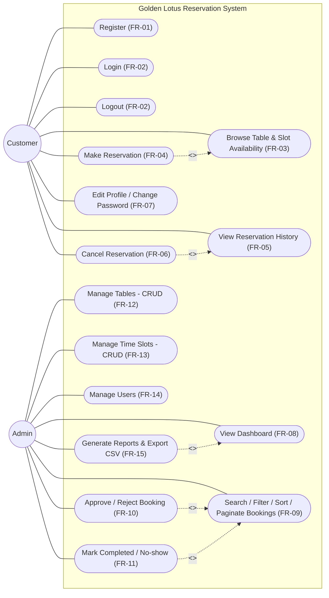
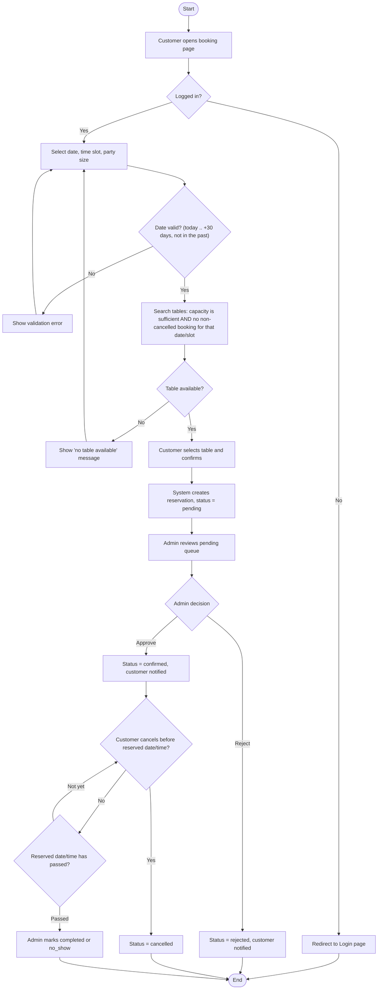
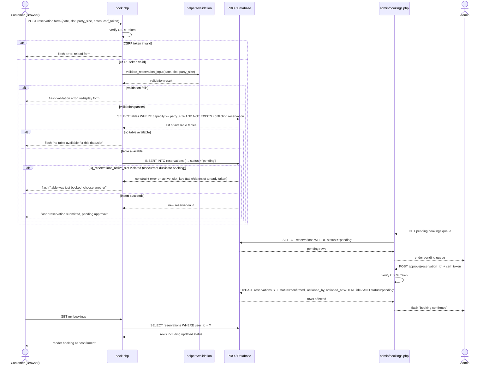

# Report Content — HSB2006 Final Project

> Paste each section's content into the lecturer's report template as it is completed.
> Filled in progressively across phases (see CLAUDE.md roadmap) — do not leave until day 15.

## 1. Cover page and project identification
- Course: HSB2006 – Developing Business Applications, Class MET4
- Project title: Golden Lotus Restaurant — Reservation System
- Repo owner: Student ID 23080025 (GitHub: met23080025-ui) — *(full name + any
  teammates' names/IDs to be added once the team table in
  `docs/requirements.md` §11 is filled in)*

## 2. Executive summary and business problem
See `docs/requirements.md` §1–2 (Business problem, Project objectives). Summary:
Golden Lotus currently takes reservations only by phone into a shared paper
diary, causing double-bookings, no customer-facing record, wasted staff time,
and no historical data for planning. This system replaces that with an online
reservation flow with enforced conflict prevention and admin reporting.

## 3. Project scope, users, assumptions, and limitations
See `docs/requirements.md` §3–5 (Scope, Assumptions and limitations, Actors).
Two actors: Customer and Admin. Full in-scope/out-of-scope feature lists and
assumptions/limitations are documented there and must not be paraphrased
differently here — copy verbatim when assembling the final report.

## 4. Functional and non-functional requirements
See `docs/requirements.md` §6–7: 15 functional requirements (FR-01…FR-15) and 6
non-functional requirements (NFR-01…NFR-06) covering performance, security,
usability, compatibility, maintainability, and data integrity.

## 5. User stories, acceptance criteria, and Project board link
See `docs/requirements.md` §8–9, §12–13: 16 user stories (US-01…US-16), each
with Given/When/Then acceptance criteria, plus a traceability matrix mapping
every story to its FR and the marking-scheme criterion it evidences.
Project board link: *(add once created — each user story becomes one issue)*

## 6. Use Case Diagram, data dictionary, Sequence Diagram, and Activity Diagram

### 6.1 Use Case Diagram
Source: `docs/diagrams/use-case.mmd`

Two actors, Customer and Admin, each with their own set of use cases, one per
functional requirement (FR-01…FR-15; login/logout is FR-02 split into two use
cases to mirror US-02/US-03). "Make Reservation" `<<include>>`s "Browse
Availability" because a booking can never be created without first running
the conflict/capacity check; "Approve/Reject" and "Mark Completed/No-show"
both `<<include>>` the booking list because the admin always locates a
booking there first. "Cancel Reservation" `<<extend>>`s "View Reservation
History" (cancelling is an optional action available while browsing history,
not something that happens every time), and "Generate Reports & Export CSV"
`<<extend>>`s "View Dashboard" (the full date-range report is an optional
deeper dive beyond the always-shown summary tiles).

### 6.2 Data dictionary
See `docs/data-dictionary.md` for the full table (`users`, `tables`,
`time_slots`, `reservations`) — column names, data types, constraints, and
descriptions, including the design note on `area` as an ENUM and the plan for
the double-booking uniqueness constraint that Phase P3 implements.

### 6.3 Activity Diagram — reservation workflow
Source: `docs/diagrams/activity-booking.mmd`

Traces the whole booking lifecycle end to end, with explicit decision points
for every branch the grader can ask about at the viva: not logged in
(redirect), an invalid date (past or beyond 30 days, loops back to the form),
no table matching the party size (loops back to the form), the admin's
approve/reject fork, the customer's cancel-before-the-reserved-time check,
and the final admin action (`completed`/`no_show`) once the slot has passed.

### 6.4 Sequence Diagram — booking submission through admin approval
Source: `docs/diagrams/sequence-booking.mmd`

Shows the object-level round trip the code in Phase P6 must implement:
`book.php` checks CSRF before anything else, then delegates validation to a
shared helper, then queries availability, then inserts with the `pending`
status. The nested `alt` block on the INSERT is the concurrency case the exam
specifically requires — a second, near-simultaneous booking for the same
table/date/slot is rejected by the database's own unique constraint, not just
the PHP check, which is the proof point for NFR-06. The lower half shows the
admin approving from the pending queue and the customer's next page load
reflecting the new `confirmed` status.

## 7. Application architecture, technology stack, and database schema

**Technology stack:** PHP 8.x (procedural/lightweight OOP, no framework),
MySQL 8/MariaDB via XAMPP, PDO with prepared statements for all queries,
HTML5 + CSS3 + Bootstrap 5 (CDN) + vanilla JavaScript. No Node.js, no
Firebase, no ORM.

**Database schema:** `database/schema.sql` creates the `golden_lotus`
database (`utf8mb4_unicode_ci`) with four tables — `users`, `tables`,
`time_slots`, `reservations` — exactly as specified in
`docs/data-dictionary.md`. Foreign keys use `ON DELETE RESTRICT` for
`user_id`/`table_id`/`time_slot_id` (records are deactivated via `is_active`,
never deleted, so history is preserved) and `ON DELETE SET NULL` for
`actioned_by`. Indexes: `reservations(reservation_date)`,
`reservations(status)`, and the existing `UNIQUE` on `users.email`.

**Double-booking constraint:** enforced by a `STORED` generated column,
`reservations.active_slot_key`, which evaluates to `NULL` when `status` is
`cancelled`/`rejected` and to `CONCAT(table_id,'_',reservation_date,'_',
time_slot_id)` otherwise, with `UNIQUE KEY uq_reservations_active_slot` on
that column. This makes the conflict check atomic at the database level
(no check-then-write race under concurrent bookings) while still letting a
cancelled/rejected slot be re-booked. Full rationale and the trigger-based
alternative that was considered and rejected: `docs/data-dictionary.md` and
the Vietnamese comment block above `CREATE TABLE reservations` in
`database/schema.sql`. Live proof that this constraint actually fires against
the seeded database (verbatim MySQL error, `information_schema` output, and
exact reproduction steps for the demo/viva): `docs/evidence/double-booking-proof.md`.

**Seed data:** `database/seed.sql` seeds 1 admin + 6 customer accounts (all
sharing the demo password `Password123!`, stored as a real bcrypt hash — see
README "Test accounts"), the 20 tables and 7 time slots locked in
`CLAUDE.md`, and 57 reservations spanning `CURDATE() - 14 days` through
`CURDATE() + 7 days` (computed relative to import time, not hard-coded, so
the demo data stays current no matter when the file is re-imported) with a
realistic status mix and a deliberate pending backlog on the next 2 days for
the admin queue demo.

**Application layer infrastructure (Phase P4b):** every page shares five
`includes/` files, required in this order: `db.php` (opens the PDO
connection — `ERRMODE_EXCEPTION`, `EMULATE_PREPARES` off, default fetch
mode `FETCH_ASSOC`), `helpers.php` (starts the session; `e()` for
`htmlspecialchars` output escaping; `set_flash()`/`get_flashes()` for
one-time Bootstrap alert messages; `csrf_token()`/`csrf_field()`/
`csrf_verify()`; `redirect()`; `is_valid_email()`/`is_strong_password()`
for registration validation), and `auth.php` (the role middleware:
`current_user()`/`is_logged_in()`/`is_admin()` read `$_SESSION['user']`,
and `require_login()`/`require_admin()` flash a message and redirect when
the check fails — pages that need protection call these before any HTML
output). `header.php`/`footer.php` render the shared Bootstrap 5 (CDN)
shell: a role-aware navbar (guest/customer/admin see different links),
the flash-message region, and the closing script tags
(`bootstrap.bundle.min.js` + `public/js/main.js`). `auth.php` only reads
session state — it does not depend on the login flow itself, which is
built in Phase P5 (`auth/login.php` will write `$_SESSION['user']` after
`password_verify()` succeeds). `index.php` was wired up to this shell as
the first real page, proving the include chain end-to-end.

## 8. Implementation evidence — annotated screenshots
*(fill progressively Phases P5-P7 — both customer and admin functions)*

## 9. Security controls and input-validation approach
*(fill Phase P8)*

Data-integrity control already captured ahead of P8: `docs/evidence/double-booking-proof.md`
documents the live database-level proof that the double-booking constraint
(the `uq_reservations_active_slot` unique index on the generated column
`active_slot_key`) rejects a direct duplicate-insert attempt with MySQL error
1062, run inside a rolled-back transaction against the real seeded database —
not just a design claim. Includes exact reproduction steps to re-run live
during the demo/viva.

## 10. Test plan, test cases, results, and unresolved defects
*(fill Phase P8)*

## 11. Installation/setup guide, test accounts, repository link, and live/local application link
*(fill Phase P9)*

## 12. References, third-party assets, and AI/tool-use declaration
*(fill Phase P9 — include the AI usage declaration table)*
