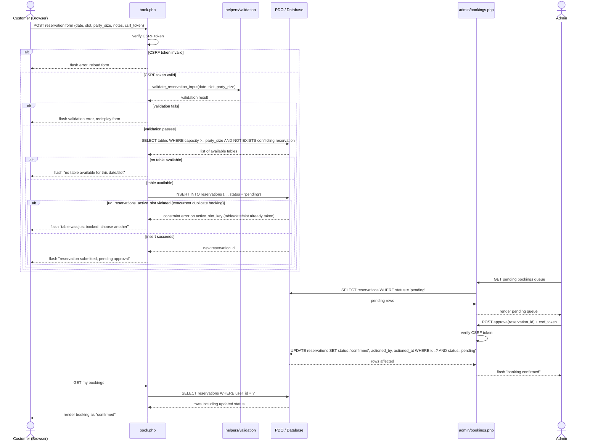

# Report Content — HSB2006 Final Project

> Paste each section's content into the lecturer's report template as it is completed.
> Filled in progressively across phases (see CLAUDE.md roadmap) — do not leave until day 15.

## 1. Cover page and project identification
- Course: HSB2006 – Developing Business Applications, Class MET4
- Project title: Golden Lotus Restaurant — Reservation System
- Repo owner: Student ID 23080025 (GitHub: met23080025-ui) — *(full name + any
  teammates' names/IDs to be added once the team table in
  `docs/requirements.md` §11 is filled in)*

## 2. Executive summary and business problem
See `docs/requirements.md` §1–2 (Business problem, Project objectives). Summary:
Golden Lotus currently takes reservations only by phone into a shared paper
diary, causing double-bookings, no customer-facing record, wasted staff time,
and no historical data for planning. This system replaces that with an online
reservation flow with enforced conflict prevention and admin reporting.

## 3. Project scope, users, assumptions, and limitations
See `docs/requirements.md` §3–5 (Scope, Assumptions and limitations, Actors).
Two actors: Customer and Admin. Full in-scope/out-of-scope feature lists and
assumptions/limitations are documented there and must not be paraphrased
differently here — copy verbatim when assembling the final report.

## 4. Functional and non-functional requirements
See `docs/requirements.md` §6–7: 15 functional requirements (FR-01…FR-15) and 6
non-functional requirements (NFR-01…NFR-06) covering performance, security,
usability, compatibility, maintainability, and data integrity.

## 5. User stories, acceptance criteria, and Project board link
See `docs/requirements.md` §8–9, §12–13: 16 user stories (US-01…US-16), each
with Given/When/Then acceptance criteria, plus a traceability matrix mapping
every story to its FR and the marking-scheme criterion it evidences.
Project board link: *(add once created — each user story becomes one issue)*

## 6. Use Case Diagram, data dictionary, Sequence Diagram, and Activity Diagram

### 6.1 Use Case Diagram
Source: `docs/diagrams/use-case.mmd`

Two actors, Customer and Admin, each with their own set of use cases, one per
functional requirement (FR-01…FR-15; login/logout is FR-02 split into two use
cases to mirror US-02/US-03). "Make Reservation" `<<include>>`s "Browse
Availability" because a booking can never be created without first running
the conflict/capacity check; "Approve/Reject" and "Mark Completed/No-show"
both `<<include>>` the booking list because the admin always locates a
booking there first. "Cancel Reservation" `<<extend>>`s "View Reservation
History" (cancelling is an optional action available while browsing history,
not something that happens every time), and "Generate Reports & Export CSV"
`<<extend>>`s "View Dashboard" (the full date-range report is an optional
deeper dive beyond the always-shown summary tiles).

### 6.2 Data dictionary
See `docs/data-dictionary.md` for the full table (`users`, `tables`,
`time_slots`, `reservations`) — column names, data types, constraints, and
descriptions, including the design note on `area` as an ENUM and the plan for
the double-booking uniqueness constraint that Phase P3 implements.

### 6.3 Activity Diagram — reservation workflow
Source: `docs/diagrams/activity-booking.mmd`

Traces the whole booking lifecycle end to end, with explicit decision points
for every branch the grader can ask about at the viva: not logged in
(redirect), an invalid date (past or beyond 30 days, loops back to the form),
no table matching the party size (loops back to the form), the admin's
approve/reject fork, the customer's cancel-before-the-reserved-time check,
and the final admin action (`completed`/`no_show`) once the slot has passed.

### 6.4 Sequence Diagram — booking submission through admin approval
Source: `docs/diagrams/sequence-booking.mmd`

Shows the object-level round trip the code in Phase P6 must implement:
`book.php` checks CSRF before anything else, then delegates validation to a
shared helper, then queries availability, then inserts with the `pending`
status. The nested `alt` block on the INSERT is the concurrency case the exam
specifically requires — a second, near-simultaneous booking for the same
table/date/slot is rejected by the database's own unique constraint, not just
the PHP check, which is the proof point for NFR-06. The lower half shows the
admin approving from the pending queue and the customer's next page load
reflecting the new `confirmed` status.

## 7. Application architecture, technology stack, and database schema

**Technology stack:** PHP 8.x (procedural/lightweight OOP, no framework),
MySQL 8/MariaDB via XAMPP, PDO with prepared statements for all queries,
HTML5 + CSS3 + Bootstrap 5 (CDN) + vanilla JavaScript. No Node.js, no
Firebase, no ORM.

**Database schema:** `database/schema.sql` creates the `golden_lotus`
database (`utf8mb4_unicode_ci`) with four tables — `users`, `tables`,
`time_slots`, `reservations` — exactly as specified in
`docs/data-dictionary.md`. Foreign keys use `ON DELETE RESTRICT` for
`user_id`/`table_id`/`time_slot_id` (records are deactivated via `is_active`,
never deleted, so history is preserved) and `ON DELETE SET NULL` for
`actioned_by`. Indexes: `reservations(reservation_date)`,
`reservations(status)`, and the existing `UNIQUE` on `users.email`.

**Double-booking constraint:** enforced by a `STORED` generated column,
`reservations.active_slot_key`, which evaluates to `NULL` when `status` is
`cancelled`/`rejected` and to `CONCAT(table_id,'_',reservation_date,'_',
time_slot_id)` otherwise, with `UNIQUE KEY uq_reservations_active_slot` on
that column. This makes the conflict check atomic at the database level
(no check-then-write race under concurrent bookings) while still letting a
cancelled/rejected slot be re-booked. Full rationale and the trigger-based
alternative that was considered and rejected: `docs/data-dictionary.md` and
the Vietnamese comment block above `CREATE TABLE reservations` in
`database/schema.sql`. Live proof that this constraint actually fires against
the seeded database (verbatim MySQL error, `information_schema` output, and
exact reproduction steps for the demo/viva): `docs/evidence/double-booking-proof.md`.

**Seed data:** `database/seed.sql` seeds 1 admin + 6 customer accounts (all
sharing the demo password `Password123!`, stored as a real bcrypt hash — see
README "Test accounts"), the 20 tables and 7 time slots locked in
`CLAUDE.md`, and 57 reservations spanning `CURDATE() - 14 days` through
`CURDATE() + 7 days` (computed relative to import time, not hard-coded, so
the demo data stays current no matter when the file is re-imported) with a
realistic status mix and a deliberate pending backlog on the next 2 days for
the admin queue demo.

**Application layer infrastructure (Phase P4b):** every page shares five
`includes/` files, required in this order: `db.php` (opens the PDO
connection — `ERRMODE_EXCEPTION`, `EMULATE_PREPARES` off, default fetch
mode `FETCH_ASSOC`), `helpers.php` (starts the session; `e()` for
`htmlspecialchars` output escaping; `set_flash()`/`get_flashes()` for
one-time Bootstrap alert messages; `csrf_token()`/`csrf_field()`/
`csrf_verify()`; `redirect()`; `is_valid_email()`/`is_strong_password()`
for registration validation), and `auth.php` (the role middleware:
`current_user()`/`is_logged_in()`/`is_admin()` read `$_SESSION['user']`,
and `require_login()`/`require_admin()` flash a message and redirect when
the check fails — pages that need protection call these before any HTML
output). `header.php`/`footer.php` render the shared Bootstrap 5 (CDN)
shell: a role-aware navbar (guest/customer/admin see different links),
the flash-message region, and the closing script tags
(`bootstrap.bundle.min.js` + `public/js/main.js`). `auth.php` only reads
session state — it does not depend on the login flow itself, which is
built in Phase P5 (`auth/login.php` will write `$_SESSION['user']` after
`password_verify()` succeeds). `index.php` was wired up to this shell as
the first real page, proving the include chain end-to-end.

**The core business workflow (Phase P6 — `includes/reservation.php`,
`customer/book.php`, `customer/my-reservations.php`, `admin/bookings.php`):**
all reservation logic lives in five functions in `includes/reservation.php`,
so every page that touches a reservation's availability or status goes
through the same code rather than re-implementing it:

- `get_available_tables()` — active tables with sufficient capacity and no
  conflicting `pending`/`confirmed` booking for the requested date/slot,
  ordered by capacity ascending (smallest sufficient table first, per the
  locked business rule — keeps large tables free for large parties).
- `is_slot_bookable()` — rejects past dates, dates past the 30-day window,
  and (for today) slots whose start time has already passed, always
  against server time (`DateTimeImmutable('now')`), never client input.
- `create_reservation()` — wraps the `INSERT` in a transaction and catches
  a `uq_reservations_active_slot` violation (`SQLSTATE[23000]`/MySQL 1062)
  as a normal "that table was just taken" result rather than letting a
  500 error surface; see `docs/evidence/double-booking-proof.md` §7 for
  the full UI-level reproduction and an important nuance discovered while
  writing it: `customer/book.php` also re-checks availability with a plain
  `SELECT` immediately before calling this function, so in practice that
  cheaper check catches almost every real double-submit before the
  `INSERT` is even attempted — the constraint-violation path this function
  handles is the last-resort net for the narrower race between that
  `SELECT` and the `INSERT`, which is what the CLI-based proof in that same
  document exercises directly.
- `can_transition()` — the single source of truth for the status lifecycle
  locked in `CLAUDE.md` (`pending → confirmed|rejected|cancelled`,
  `confirmed → completed|no_show|cancelled`, all other states terminal).
  Every status change, from either the customer (cancel) or admin
  (approve/reject/complete/no-show) side, is routed through
  `change_reservation_status()`, which calls this — no page updates
  `reservations.status` directly.
- `change_reservation_status()` — validates via `can_transition()`, locks
  the target row with `SELECT ... FOR UPDATE` inside a transaction (so two
  near-simultaneous status changes on the same reservation can't both read
  the same stale status), records `actioned_by`/`actioned_at`.

`customer/book.php` follows the search-then-select flow locked in
`docs/design-process.md` §4.3 (date/party size/slot chosen together before
searching; table chosen only from the results) via GET for the idempotent
search and POST for the state-changing confirm (PRG pattern per §7),
re-validating the submitted `table_id` against a fresh
`get_available_tables()` call rather than trusting the form. Both
`customer/my-reservations.php`'s cancel action and `admin/bookings.php`'s
approve/reject/complete/no-show actions enforce their eligibility rules
(ownership, status, and — for cancel — that the reservation is still in
the future) server-side, not merely by hiding the button in the UI.

## 8. Implementation evidence — annotated screenshots
*(fill progressively Phases P5-P7 — both customer and admin functions)*

**Phase P7 status (2026-08-05):** FR-09…FR-15 are implemented and smoke-tested
end-to-end (see `docs/test-plan.md` for formal cases to be logged in Phase
P8): `admin/bookings.php` (search/filter/sort/pagination on top of the P6
approval queue), `admin/tables.php` and `admin/timeslots.php` (full CRUD,
deactivate-instead-of-delete when reservations reference the row, overlap
validation for time slots), `admin/users.php` (search/role filter,
activate/deactivate, role change, self-protection enforced server-side),
`admin/dashboard.php` (four live-SQL summary tiles + pending-queue preview),
`admin/reports.php` (date-range stats, HTML/CSS bar charts, CSV export), and
`customer/dashboard.php` (next reservation, status counts, recent history).
Screenshots for this section still need to be captured manually per the
reminder below — nothing here substitutes for that.

## 9. Security controls and input-validation approach

**Authentication (Phase P5 — `auth/register.php`, `auth/login.php`,
`auth/logout.php`, `customer/profile.php`):**

- Passwords are hashed with `password_hash($password, PASSWORD_DEFAULT)`
  and checked with `password_verify()`; the plaintext value is never
  logged, echoed, or stored. Registration enforces a minimum-strength rule
  (`is_strong_password()` in `includes/helpers.php`: ≥8 characters, at
  least one letter and one digit) server-side, in addition to the
  client-side `minlength` hint.
- Login returns the same generic *"Invalid email or password."* message
  whether the email doesn't exist or the password is wrong, and always
  calls `password_verify()` against a dummy bcrypt hash when no matching
  user is found — both measures defend against user enumeration (an
  attacker probing which emails are registered), the second one closing
  the timing side-channel the first alone wouldn't.
- A successful login calls `session_regenerate_id(true)` immediately
  (session-fixation defence) before writing `$_SESSION['user']`. A locked
  account (`is_active = 0`) is refused login with a distinct, clear
  message once credentials are otherwise correct.
- **Open-redirect defence:** the homepage's "Book a Table" CTA sends
  signed-out visitors to `auth/login.php?redirect=/customer/book.php` so
  they land back where they meant to go after authenticating. That
  `redirect` value is attacker-controllable input, so it is never used
  directly — `safe_redirect_target()` (`includes/helpers.php`) only
  accepts it if it starts with a single `/` (rejects `//host` protocol-relative
  URLs), contains no `://` or scheme prefix, and contains no backslash or
  control characters; anything else silently falls back to the
  role-based dashboard. Manually verified with three payloads
  (`https://evil.example`, `//evil.example`, `/\evil.example`) — all three
  are dropped and the login instead lands on the normal dashboard; see the
  full Vietnamese rationale comment above the function.
- Every state-changing form (register, login, logout, profile update,
  password change) carries a CSRF token (`csrf_field()`/`csrf_verify()`,
  `hash_equals()` comparison) checked before any other processing.
- `customer/dashboard.php` calls `require_login()` and
  `admin/dashboard.php` calls `require_admin()` — manually verified that
  an unauthenticated request to either is redirected to login, and that a
  logged-in customer hitting `admin/dashboard.php` is redirected away
  rather than shown the page.
- Profile email edits re-check uniqueness excluding the user's own row
  (`WHERE email = ? AND id != ?`); password changes require the correct
  current password (`password_verify()`) before a new hash is written.

**SQL injection (Phase P7/P8 — every query site, `includes/listing.php`):**
100% of queries are PDO prepared statements with bound values
(`PDO::ATTR_EMULATE_PREPARES => false` in `includes/db.php`, native
prepares). The one gap prepared statements structurally cannot close is
**identifiers** — a bound parameter can only stand in for a value, never a
column name, so the admin listing pages' sortable columns
(`admin/bookings.php`, `admin/tables.php`, `admin/timeslots.php`,
`admin/users.php`) resolve the `?sort=` URL parameter through a hard-coded
**whitelist** (`resolve_sort()` in `includes/listing.php`) before it ever
touches the `ORDER BY` clause — any value not in the whitelist silently
falls back to the page's default column rather than being concatenated in.
`LIMIT`/`OFFSET` are bound as `PDO::PARAM_INT` explicitly, since native
prepares reject string-typed values there.

**Admin CRUD input validation (Phase P7 — `admin/tables.php`,
`admin/timeslots.php`):** table code must match `/^[A-Z][0-9]{2}$/` and be
unique (checked excluding the row's own id on edit); capacity must be
1–20; area must be one of the four locked ENUM values. Time slots require
`end_time > start_time` and are checked for overlap against every other
currently-**active** slot (`start < new_end AND end > new_start`), again
excluding the row's own id on edit. Both pages refuse a hard `DELETE` when
`SELECT COUNT(*) FROM reservations WHERE table_id/time_slot_id = ?` is
non-zero, offering deactivation (`is_active = 0`) instead — this keeps
booking history intact and is backed by the schema's own
`ON DELETE RESTRICT` foreign keys as a second layer, so the check being
bypassed somehow would still not allow an orphaned reservation row.

**Admin self-protection (Phase P7 — `admin/users.php`):** an admin cannot
deactivate or change the role of their own currently-logged-in account,
checked server-side before any action-specific branch runs (not just a
hidden button), because there is no separate "recovery" admin account or
CLI tool in this project's scope to undo a self-lockout.

**Full defect list:** see `docs/test-plan.md`'s "Known unresolved defects"
table at the bottom, filled in as each of its 43 test cases is actually
run. One candidate is already flagged in that document (TC-28):
`can_transition()` permits a `confirmed → completed/no_show` transition
regardless of whether the booking's date/time has actually passed — the
UI only ever exposes the buttons once it has, but a forged direct POST
could act early. Decide before submission whether to close this gap or
accept and document it as a known limitation.

Full control-by-control detail, each referenced to its exact implementing
file, is in **`docs/security-review.md`** — written as a standalone
document so it can be read side by side with the code; the table below is
its summary:

| Control | Implemented in | Defends against |
|---|---|---|
| PDO prepared statements (100% of queries) | `includes/db.php` + every query site | SQL injection via values |
| ORDER BY column whitelist | `includes/listing.php` | SQL injection via identifiers |
| `password_hash()`/`password_verify()` | `auth/register.php`, `auth/login.php` | Credential theft on data breach |
| Dummy-hash timing defence | `auth/login.php` | Timing-based user enumeration |
| Generic login error message | `auth/login.php` | Message-based user enumeration |
| `session_regenerate_id(true)` | `auth/login.php`, `auth/logout.php` | Session fixation |
| CSRF token + `hash_equals()` | `includes/helpers.php` + every POST form | Cross-site request forgery |
| `e()` / `htmlspecialchars(ENT_QUOTES)` | `includes/helpers.php` + every dynamic echo | Stored/reflected XSS |
| Server-side re-validation of every client rule | throughout | Client-side-bypass |
| `require_login()` / `require_admin()` | `includes/auth.php` | Unauthorised access |
| Admin self-protection check | `admin/users.php` | Accidental/malicious admin lockout |
| Two-layer double-booking defence | `customer/book.php` + `database/schema.sql` | Race-condition double-booking |
| `safe_redirect_target()` | `includes/helpers.php` | Open redirect / phishing |
| `ON DELETE RESTRICT` + deactivate-vs-delete | `database/schema.sql` + admin CRUD pages | Orphaned reservation records |
| `config.php` gitignored | `.gitignore` | Credential leakage via source control |

Data-integrity control captured with live evidence:
`docs/evidence/double-booking-proof.md` documents the database-level proof
that the double-booking constraint (the `uq_reservations_active_slot`
unique index on the generated column `active_slot_key`) rejects a direct
duplicate-insert attempt with MySQL error 1062, run inside a rolled-back
transaction against the real seeded database — not just a design claim —
plus a UI-level reproduction (§7 of that document) showing the same
guarantee holds end to end through `customer/book.php`, with the two
defence layers explained and which one a human-timed demo will actually
show.

## 10. Test plan, test cases, results, and unresolved defects

Full test plan: **`docs/test-plan.md`** — 43 test cases across 10 modules
(Registration, Login/Logout, Access control, Open-redirect, Booking
happy-path/edge-cases, Cancellation, Admin status transitions, Admin CRUD
validation, Self-protection, Search/filter/sort/pagination, Reports/CSV,
Security probes). Each case has an ID, module, objective, preconditions,
exact steps, and expected result; **Actual result** and **Pass/Fail**
columns are filled in by hand as each case is executed against a fresh
`schema.sql` + `seed.sql` import. Known unresolved defects (populated as
cases are run) are logged in that same document's final table — copy the
completed table into this section once testing is finished, along with a
short summary of the pass rate (e.g. "41/43 passed on first run; 2 defects
found and fixed, re-tested and passing" or similar, once true).

## 11. Installation/setup guide, test accounts, repository link, and live/local application link

**Repository:**
https://github.com/met23080025-ui/FINAL-EXAMINATION-HSB2006-DEVELOPING-BUSINESS-APPLICATIONS

**Local application URL (XAMPP):** `http://localhost/golden-lotus/`

**Prerequisites:** [XAMPP](https://www.apachefriends.org/) (Apache +
MySQL/MariaDB + PHP 8.x). Verified against PHP 8.0.30; no version-specific
syntax beyond PHP 8.0 is used, so any current PHP 8.2+ release should also
work.

**Setup steps:**
1. Start Apache and MySQL from the XAMPP control panel.
2. Clone/copy the repository into `C:\xampp\htdocs\golden-lotus` (or the
   equivalent `htdocs` path on macOS/Linux XAMPP).
3. Copy `config.sample.php` to `config.php` and fill in DB credentials
   (defaults `root` / empty password match a stock XAMPP install).
   `config.php` is gitignored and must never be committed.
4. Open phpMyAdmin (`http://localhost/phpmyadmin`), create a database named
   to match `DB_NAME` in `config.php` (default `golden_lotus`), then import
   `database/schema.sql` first, then `database/seed.sql` second.
5. Visit `http://localhost/golden-lotus/` (adjust `BASE_URL` in
   `config.php` if the folder name differs).

**Test accounts** (all share the demo password `Password123!`, stored only
as a real bcrypt hash — see `docs/security-review.md` §3 for why every
seeded account's hash is byte-identical and why that's expected):

| Role | Email | Password |
|------|-------|----------|
| Admin | admin@goldenlotus.test | Password123! |
| Customer | customer1@goldenlotus.test … customer6@goldenlotus.test | Password123! |

**Demo dataset:** ~57 reservations spanning the 14 days before import
through 7 days after, computed relative to `CURDATE()` at import time (not
hard-coded dates), so the dataset stays "current" no matter when it's
re-imported for grading. A deliberate pending backlog is seeded in the next
2 days so the admin approval queue is never empty on a fresh import.

## 12. References, third-party assets, and AI/tool-use declaration

**Third-party assets:**

| Asset | Licence | Use |
|---|---|---|
| [Bootstrap 5.3.3](https://getbootstrap.com/) | MIT License | UI component library + grid, loaded via `cdn.jsdelivr.net`, no local copy vendored |

*(TODO — add any additional icon sets, fonts, or images if introduced
before submission; none beyond Bootstrap are used as of Phase P7.)*

**References:** *(TODO by hand — cite the HSB2006 course materials/rubric
document and any external documentation consulted, e.g. PHP manual pages
for `password_hash`/PDO, MDN for specific HTML5 attributes, in whatever
citation style the lecturer's report template requires.)*

**AI/tool-use declaration:** an interim, phase-by-phase record of what AI
assistance was used for and how the output was verified is maintained
throughout development in `docs/development-log.md` (see its "AI usage
record" section) — copy/format that table into the final report here.
**TODO by hand before submission:**
- Review the `docs/development-log.md` AI-usage table for accuracy against
  what actually happened in each session.
- Add any AI usage from Phases P8/P9 that happens *after* this handover
  (e.g. if a teammate uses another AI tool to help write remaining
  report prose).
- State explicitly, per the course's requirement, that AI usage does not
  transfer responsibility for correctness, security, licensing, or
  originality — the team verified and takes ownership of all code and
  content submitted.

**TODO by hand — not yet knowable from the codebase:**
- Full names for the cover page and `docs/requirements.md` §11 team table
  (currently only student ID 23080025 / GitHub `met23080025-ui` is on
  record).
- Final submission filenames per `CLAUDE.md`
  (`HSB2006_MET4_23080025_<FullName>_Report.pdf` etc.) once the full name
  is filled in.
- GitHub Project board link (`docs/requirements.md` §12) once created.
- Screenshots for §8 — see `docs/screenshot-checklist.md` for the full,
  page-by-page list.
- Test-plan Actual result/Pass-Fail columns and the defect list (§10).
